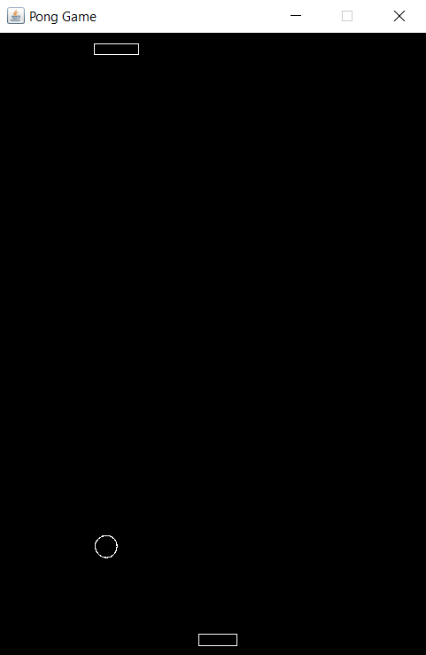
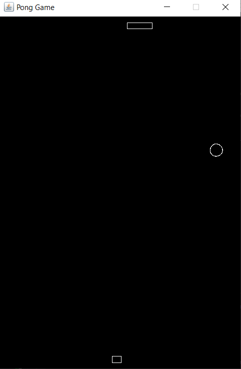

# PongGame
The classic pong game written in Java. Instead of a score system, on each point loss, the paddle width of the loser will reduce. The game is over when the paddle width is 0 and the winner is declared (reduced paddle width can be seen in the bottom paddle of the second image). 

  

  

